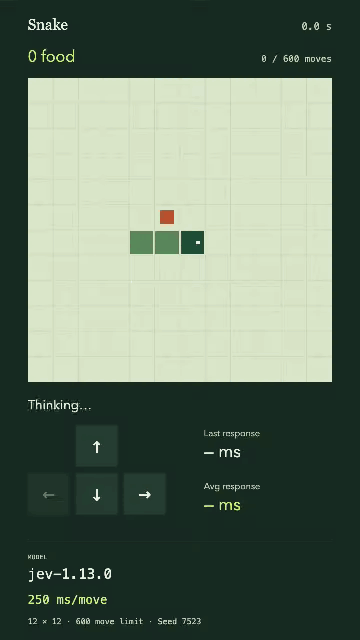

# Jev plays Snake

An experiment in letting [Jev](https://typesafe.ai/) play Snake. Watch recorded games, replay its decisions, and explore what we learned from different inputs.



## The demo

The latest three games scored **21, 23 and 29 food**. The best take lasted **73 seconds** before the snake collided with itself. [Raw session JSON](results/2026-09-20-demo-250ms-v3.json).

Jev reads structured board state, with collision and food facts calculated by the game engine, and chooses each turn. The replay player lets you inspect any move, see response times, and export a video.

## What we learned

- **Identical inputs can produce different choices.** Actions varied in two of five positions tested ten times each with the original input format.
- **How we presented the board mattered.** Correct decisions on fixed boards rose from 15/48 with the original input to 46/48 with computed move facts.
- **Replies averaged 141.5 ms in the latest session.** The p95 was 211.4 ms across 683 replies, measured at the client.

Read the [findings and supporting evidence](docs/findings.md). The [raw JSON files](results/) include earlier failures, input experiments and scripted controls.

## Try it

To record a session with your own TypeSafe API key, check the [setup requirements](docs/usage.md), then run:

```sh
git clone https://github.com/matthewman/jev-snake.git
cd jev-snake
npm run setup
# Open .env and add your TYPESAFE_API_KEY.
npm run record
npm start
```

Recording makes paid API calls and automatically saves and verifies your session. Then open [localhost:4174](http://127.0.0.1:4174) to watch it. The key stays in the local recording process.

To try an existing recording without a key:

```sh
npm run replay -- 2026-09-20-demo-250ms-v3
npm start
```

See the [setup guide](docs/usage.md) for settings and video export. The current player shows completed recordings; it does not stream the run live.

[MIT license](LICENSE). Independent project, not an official TypeSafe product. Built with Codex.
